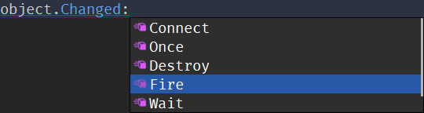
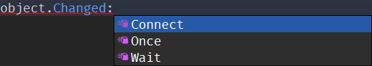

# LuauSignal
A faster and more equipped Luau implementation of [BindableEvent](https://create.roblox.com/docs/reference/engine/classes/BindableEvent)

# Why?
Besides being a lot lighter and a lot faster than `BindableEvent`, the main motive for using this over other signal implementations is to keep methods like `:Fire` hidden from objects that have events, so instead of your events looking like this:



They would instead look like this:



Which makes a lot more sense given that typically the usage of `:Fire` is internal only.

# Features
This isnt your usual run-of-the-mill implementation either, it has per signal coroutine optimization to make `:Fire` go brrr and has two new features.

## Reconnect
You take connect, you prefix it with a re, and you got yourself a handy method for reconnecting disconnected connections!
```lua
local event = LuauEvent.new()

local connection = event.Event:Connect(function(s: string)
    print(s)
end)

event:Fire("Hello world!") --> Hello world!

connection:Disconnect()

event:Fire("Goodbye world!") -- wont print anything

connection:Reconnect()

event:Fire("Hello again!") --> Hello again!
```

## Variadic connections
When using signals, sometimes you have to make function to call another function, but with variadic connections that becomes no more!

*Note: The variadics you pass when connecting will always come before the ones you pass in `:Fire`*

```lua
local event = LuauEvent.new()

event.Event:Connect(print, "Hello")

event:Fire("world!") --> Hello world!
```